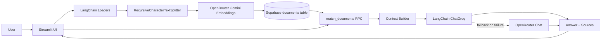
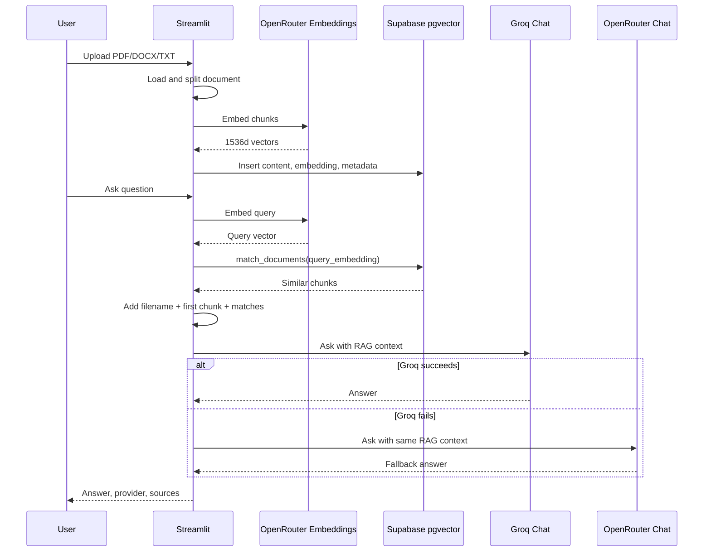
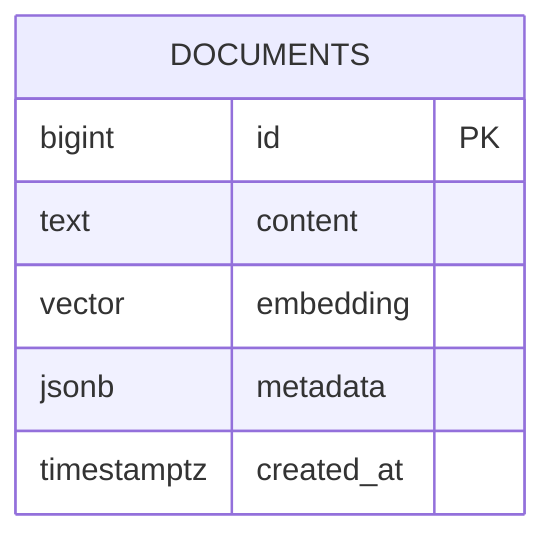
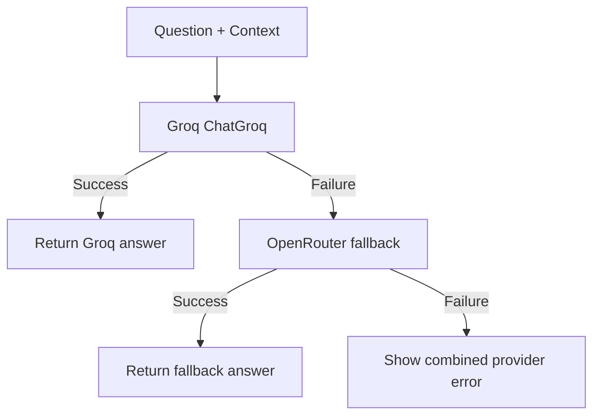

# Document RAG Chatbot

A document Retrieval-Augmented Generation (RAG) chatbot built with Streamlit, LangChain, Supabase pgvector, Groq, and OpenRouter-hosted Gemini embeddings.

The app lets users upload PDF, DOCX, or TXT documents, stores vectorized chunks in Supabase, retrieves relevant context, and answers questions with Groq as the primary chat provider. If Groq fails, the app automatically falls back to OpenRouter chat.

## Highlights

- Chat-first Streamlit workspace for document Q&A
- PDF, DOCX, and TXT ingestion with LangChain loaders
- OpenRouter `google/gemini-embedding-001` embeddings at 1536 dimensions
- Supabase `pgvector` storage and RPC-based similarity search
- Groq `llama-3.3-70b-versatile` primary chat model
- OpenRouter `google/gemini-2.5-flash` fallback chat model
- Sidebar credential settings with session-only or save-to-local-`.env` mode
- Document header anchoring for questions about names, titles, and contact details
- Lightweight document profile with detected sections, notes, and key info
- Batched embeddings and inserts for larger documents
- Image text extraction intentionally excluded

## Architecture



## Request Flow



## Data Model



Each row stores one document chunk. The `metadata` JSON includes at least:

- `filename`: uploaded document name
- `chunk_index`: zero-based chunk position for newly processed documents

The vector column is `vector(1536)` to match `google/gemini-embedding-001`.

## Tech Stack

| Layer | Technology |
| --- | --- |
| UI | Streamlit |
| RAG orchestration | LangChain |
| Primary chat | Groq via `langchain-groq` |
| Fallback chat | OpenRouter chat completions |
| Embeddings | OpenRouter `google/gemini-embedding-001` |
| Vector database | Supabase Postgres + pgvector |
| Document loading | LangChain PDF/DOCX/TXT loaders |
| Package manager | `uv` |

## Requirements

- Python 3.11+
- `uv`
- Supabase project with SQL editor access
- Groq API key
- OpenRouter API key

## Required Environment Variables

| Variable | Required | Purpose |
| --- | --- | --- |
| `GROQ_API_KEY` | Yes | Primary chat completions through Groq |
| `OPENROUTER_API_KEY` | Yes | Gemini embeddings and fallback chat |
| `SUPABASE_URL` | Yes | Supabase project URL, for example `https://<project-ref>.supabase.co` |
| `SUPABASE_KEY` | Yes | Supabase API key used by the Streamlit app |

Credentials can be entered from the Streamlit sidebar. They are applied to the current session immediately. Select `Save to .env` only when you want to persist them locally.

Example `.env`:

```env
GROQ_API_KEY=your_groq_key
OPENROUTER_API_KEY=your_openrouter_key
SUPABASE_URL=https://your-project-ref.supabase.co
SUPABASE_KEY=your_supabase_anon_or_service_key
```

`.env` must remain local and untracked.

## Supabase Setup

Run `supabase_setup.sql` once in the Supabase SQL Editor. It creates:

- `vector` extension
- `public.documents` table
- `embedding vector(1536)` column
- IVFFlat cosine index
- `public.match_documents(...)` RPC
- basic read/insert policies for the `anon` role

```bash
# File to run in Supabase SQL Editor
supabase_setup.sql
```

After running the SQL, Supabase should expose the `documents` table and `match_documents` function through the API schema cache.

## Installation

```bash
uv sync --locked
```

If the Windows `.venv` is locked, stop the running Streamlit process and retry the command.

## Run Locally

```bash
python -m streamlit run app/UI/Streamlit_app.py
```

Then open the Streamlit URL printed in the terminal.

## Usage

1. Open the app.
2. Add credentials in the sidebar Settings section.
3. Upload a PDF, DOCX, or TXT document.
4. Click `Process and Save`.
5. Ask questions in the chat.
6. Check provider metadata under answers to see whether Groq or OpenRouter handled the response.

## Retrieval Strategy

The app combines semantic retrieval with deterministic document anchors:

- Query is embedded with Gemini Embedding 001.
- Supabase returns similar chunks via `match_documents`.
- Results are filtered to the currently loaded filename.
- New uploads include a per-document id in metadata for cleaner filtering.
- The context sent to the chat model includes:
  - document filename
  - filename words
  - detected document sections, notes, and key info
  - first/header chunk
  - top retrieved chunks

This improves questions like “who owns this CV?”, where the answer is often in the document header instead of the most semantically similar chunk.

## Provider Behavior



Default models:

- Chat primary: `llama-3.3-70b-versatile`
- Chat fallback: `google/gemini-2.5-flash`
- Embeddings: `google/gemini-embedding-001`

## Project Structure

```text
.
├── app/
│   ├── UI/
│   │   └── Streamlit_app.py
│   ├── config/
│   │   └── settings.py
│   ├── rag/
│   │   └── chatbot.py
│   └── vectorstore/
│       └── supabase_store.py
├── embeddings/
│   └── embedding_model.py
├── supabase_setup.sql
├── pyproject.toml
├── uv.lock
└── README.md
```

## Validation

```bash
python3 -m compileall app embeddings main.py
uv lock --check
git diff --check
```

## Security And Privacy

- Uploaded documents may contain personal data such as names, phone numbers, email addresses, and links.
- The app can answer questions about that data if it exists in the uploaded document.
- Do not deploy this publicly without access control, document retention rules, and a privacy policy.
- Do not commit `.env` or API keys.
- Prefer Supabase Row Level Security policies that match your real deployment model before production use.
- The included SQL is suitable for local/prototype use; tighten policies for multi-user production.

## Production Notes

Before deploying beyond local development:

- Add authentication for the Streamlit app.
- Scope Supabase rows by user or workspace.
- Replace broad anon read/insert policies with least-privilege policies.
- Add document deletion and retention controls.
- Add rate limits around uploads, embeddings, and chat requests.
- Add observability for provider failures, fallback usage, and retrieval quality.
- Add automated tests for loaders, chunking, retrieval filtering, and provider fallback.

## Troubleshooting

| Symptom | Likely Cause | Fix |
| --- | --- | --- |
| `Could not find table public.documents` | Supabase SQL was not run or schema cache is stale | Run `supabase_setup.sql`, then wait or reload schema |
| `Missing ... API key` | Sidebar settings or `.env` is incomplete | Add required credentials in Settings |
| Groq `1010` or provider failure | Groq rejected the chat request | The app should fall back to OpenRouter automatically |
| Answers come from the wrong document | Old rows exist in Supabase | Clear/reprocess documents or scope rows by filename/user |
| “No relevant information found” | No chunks were stored or retrieval returned nothing | Reprocess the file and verify Supabase rows |
| `uv sync` fails on Windows `.venv/Scripts` | Running app locked the virtualenv | Stop Streamlit and rerun `uv sync --locked` |

## Current Scope

This is a document RAG application, not an image extraction app.

Supported uploads:

- PDF
- DOCX
- TXT

Not included:

- image text extraction
- image document extraction
- LangGraph agents
- legacy provider SDK usage

## Author

Israel
